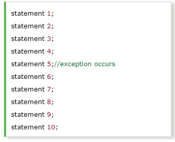
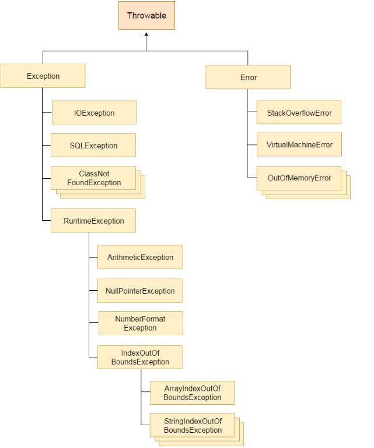

# Exception Handling

## What is Exception in Java?
Dictionary Meaning: Exception is an abnormal condition.
In Java, an exception is an event that disrupts the normal flow of the program. It is an object which is thrown at runtime.

## What is Exception Handling?
Exception Handling is a mechanism to handle runtime errors such as ClassNotFoundException, IOException, SQLException, RemoteException, etc.

<a href="http://www.youtube.com/watch?feature=player_embedded&v=YOUTUBE_VIDEO_ID_HERE
" target="_blank"></a>

### 1. Advantage of Exception Handling
The core advantage of exception handling is to maintain the normal flow of the application. An exception normally disrupts the normal flow of the application that is why we use exception handling. Let's take a scenario:



### 2. Do You Know?
* What is the difference between checked and unchecked exceptions?
* What happens behind the code int data=50/0;?
* Why use multiple catch block?
* Is there any possibility when finally block is not executed?
* What is exception propagation?
* What is the difference between throw and throws keyword?
* What are the 4 rules for using exception handling with method overriding?

## Hierarchy of Java Exception classes
The java.lang.Throwable class is the root class of Java Exception hierarchy which is inherited by two subclasses: Exception and Error. A hierarchy of Java Exception classes are given below:



## Types of Java Exceptions
There are mainly two types of exceptions: checked and unchecked. Here, an error is considered as the unchecked exception. According to Oracle, there are three types of exceptions:
1. Checked Exception
2. Unchecked Exception
3. Error

## Difference between Checked and Unchecked Exceptions

1. Checked Exception. The classes which directly inherit Throwable class except RuntimeException and Error are known as checked exceptions e.g. IOException, SQLException etc. Checked exceptions are checked at compile-time.
2. Unchecked Exception.  The classes which inherit RuntimeException are known as unchecked exceptions e.g. ArithmeticException, NullPointerException, ArrayIndexOutOfBoundsException etc. Unchecked exceptions are not checked at compile-time, but they are checked at runtime.
3. Error. Error is irrecoverable e.g. OutOfMemoryError, VirtualMachineError, AssertionError etc.

## Java Exception Keywords
There are 5 keywords which are used in handling exceptions in Java.

| Keyword       | Description   |
|:-------------:||
| `try`   |&nbsp;&nbsp; The `try` keyword is used to specify a block where we should place exception code. The try block must be followed by either catch or finally. It means, we can't use try block alone. |
|-------------|-------------|
| `catch`  |&nbsp;&nbsp; The `catch` block is used to handle the exception. It must be preceded by try block which means we can't use catch block alone. It can be followed by finally block later.     |
|-------------|-------------|
| `finally`|&nbsp;&nbsp; The `finally` block is used to execute the important code of the program. It is executed whether an exception is handled or not. |
|-------------|-------------|
| `throw`  |&nbsp;&nbsp;The `throw` keyword is used to throw an exception. |
|-------------|-------------|
| `throws` |&nbsp;&nbsp;The `throws` keyword is used to declare exceptions. It doesn't throw an exception. It specifies that there may occur an exception in the method. It is always used with method signature. |
|-------------|-------------|

## Java Exception Syntax
``` javascript

  tray{

      statment here.....;

  }catch(...){
  
      statment here.....;
  
  }finally(...){
  
  }
  
  // throws
  void m()throws IOException{  
    throw new IOException("device error");//checked exception  
  }  
```
## Java Exception Handling Example
Let's see an example of Java Exception Handling where we using a try-catch statement to handle the exception.
### Example Code
``` javascript
  public class JavaExceptionExample{  
   
   void m()throws IOException{  
					throw new IOException("device error");//checked exception  
   }    
   
   void n(int age){  
     if(age<18)  
      throw new ArithmeticException("not valid");  
     else  
      System.out.println("welcome to vote");  
   }  
   
   public static void main(String args[]){  
    try{  

									//code that may raise exception  
         int data=100/0; 
		 
       }catch(ArithmeticException e){System.out.println(e);} 
	   
         //rest code of the program   
         System.out.println("rest of the code...");  
       }  
  }  
```
### Common Scenarios of Java Exceptions
1) A scenario where ArithmeticException occurs
If we divide any number by zero, there occurs an ArithmeticException.
``` javascript
					int a=50/0;  //ArithmeticException  
``` 
2) A scenario where NullPointerException occurs
If we have a null value in any variable, performing any operation on the variable throws a NullPointerException.
``` javascript
					String s=null;  
					System.out.println(s.length());  //NullPointerException  
``` 
3) A scenario where NumberFormatException occurs
The wrong formatting of any value may occur NumberFormatException. Suppose I have a string variable that has characters, converting this variable into digit will occur NumberFormatException.
``` javascript
					String s="abc";  
					int i=Integer.parseInt(s);  //NumberFormatException  
``` 
4) A scenario where ArrayIndexOutOfBoundsException occurs
If you are inserting any value in the wrong index, it would result in ArrayIndexOutOfBoundsException as shown below:
``` javascript
					int a[]=new int[5];  
					a[10]=50; //ArrayIndexOutOfBoundsException  
``` 

## Java Exception Types

1. [Java Try-Catch Block](#javatrycatchblock)
2. [Java Multiple Catch Block](#javamultiplecatchblock) 
3. [Java Nested Try](#javanestedtry)
4. [Java Finally Block](#javafinallyblock)
5. [Java Throw Keyword](#javathrowkeyword)
6. [Java Throws Keyword](#javathrowskeyword)
7. [Difference between throw and throws in Java](#differencethrow_hrows)

## Try Out
 [Exercise 3A](./pdf/exercise3a.pdf)
 
 [Exercise 3B](./pdf/exercise3b.pdf)
 
 

# Java Exception Types :

 # 1. Java Try-Catch Block (#javatrycatchblock)
------------------------------------
## Java try block
Java try block is used to enclose the code that might throw an exception. It must be used within the method.

If an exception occurs at the particular statement of try block, the rest of the block code will not execute. So, it is recommended not to keeping the code in try block that will not throw an exception.

Java try block must be followed by either catch or finally block.

**Syntax of Java try-catch**
``` javascript
				try{    
				
							//code that may throw an exception    
				
				}catch(Exception_class_Name ref){}    
```
**Syntax of try-finally block**
``` javascript
				try{    
				
							//code that may throw an exception    
				
				}finally{}  
```

### Problem without exception handling
Let's try to understand the problem if we don't use a try-catch block.

#### Example 1
``` javascript
public class TryCatchExample1 {  
  
    public static void main(String[] args) {  
          
        int data=50/0; //may throw exception   
          
        System.out.println("rest of the code");  
          
    }  
      
}  
``` 
**Output:**
```
Exception in thread "main" java.lang.ArithmeticException: / by zero
```
As displayed in the above example, the rest of the code is not executed (in such case, the rest of the code statement is not printed).

There can be 100 lines of code after exception. So all the code after exception will not be executed.

### Solution by exception handling
Let's see the solution of the above problem by a java try-catch block.

#### Example 2
``` javascript
public class TryCatchExample2 {  
  
    public static void main(String[] args) {  
        try  
        {  
        int data=50/0; //may throw exception   
        }  
            //handling the exception  
        catch(ArithmeticException e)  
        {  
            System.out.println(e);  
        }  
        System.out.println("rest of the code");  
    }  
      
}  
``` 
Test it Now.....

**Output:**
``` 
java.lang.ArithmeticException: / by zero
rest of the code
``` 
Now, as displayed in the above example, the rest of the code is executed, i.e., the rest of the code statement is printed.


# 2. Java Multiple Catch Block{#javamultiplecatchblock}
------------------------------------

## Java Multi-catch block
A try block can be followed by one or more catch blocks. Each catch block must contain a different exception handler. So, if you have to perform different tasks at the occurrence of different exceptions, use java multi-catch block.

## Points to remember
At a time only one exception occurs and at a time only one catch block is executed.
All catch blocks must be ordered from most specific to most general, i.e. catch for ArithmeticException must come before catch for Exception.

### Example 1
Let's see a simple example of java multi-catch block.
``` javascript
public class MultipleCatchBlock1 {  
  
    public static void main(String[] args) {  
          
           try{    
                int a[]=new int[5];    
                a[5]=30/0;    
               }    
               catch(ArithmeticException e)  
                  {  
                   System.out.println("Arithmetic Exception occurs");  
                  }    
               catch(ArrayIndexOutOfBoundsException e)  
                  {  
                   System.out.println("ArrayIndexOutOfBounds Exception occurs");  
                  }    
               catch(Exception e)  
                  {  
                   System.out.println("Parent Exception occurs");  
                  }             
               System.out.println("rest of the code");    
    }  
}  
``` 
Test it Now ...
**Output:**
``` 
Arithmetic Exception occurs
rest of the code
``` 

### Example 2
``` javascript
public class MultipleCatchBlock2 {  
  
    public static void main(String[] args) {  
          
           try{    
                int a[]=new int[5];    
                
                System.out.println(a[10]);  
               }    
               catch(ArithmeticException e)  
                  {  
                   System.out.println("Arithmetic Exception occurs");  
                  }    
               catch(ArrayIndexOutOfBoundsException e)  
                  {  
                   System.out.println("ArrayIndexOutOfBounds Exception occurs");  
                  }    
               catch(Exception e)  
                  {  
                   System.out.println("Parent Exception occurs");  
                  }             
               System.out.println("rest of the code");    
    }  
}  
``` 

Test it Now ....

**Output:**
``` 
ArrayIndexOutOfBounds Exception occurs
rest of the code
``` 

# 3. Java Nested Try {#javanestedtry}
------------------------------------
## Java Nested try block
The try block within a try block is known as nested try block in java.

Why use nested try block
Sometimes a situation may arise where a part of a block may cause one error and the entire block itself may cause another error. In such cases, exception handlers have to be nested.

### Syntax:
``` javascript
....  
try  
{  
    statement 1;  
    statement 2;  
    try  
    {  
        statement 1;  
        statement 2;  
    }  
    catch(Exception e)  
    {  
    }  
}  
catch(Exception e)  
{  
}  
....  
```
### Java nested try example
Let's see a simple example of java nested try block.

``` javascript
class Excep6{  
 public static void main(String args[]){  
  try{  
    try{  
     System.out.println("going to divide");  
     int b =39/0;  
    }catch(ArithmeticException e){System.out.println(e);}  
   
    try{  
    int a[]=new int[5];  
    a[5]=4;  
    }catch(ArrayIndexOutOfBoundsException e){System.out.println(e);}  
     
    System.out.println("other statement);  
  }catch(Exception e){System.out.println("handeled");}  
  
  System.out.println("normal flow..");  
 }  
}  
```

# 4. Java Finally Block{#javafinallyblock}
------------------------------------
### Java finally block
Java finally block is a block that is used to execute important code such as closing connection, stream etc.

Java finally block is always executed whether exception is handled or not.

Java finally block follows try or catch block.


```
Note: If you don't handle exception, before terminating the program, JVM executes finally block(if any).
```
### Why use java finally
Finally block in java can be used to put ``cleanup`` code such as closing a file, closing connection etc.

### Usage of Java finally
Let's see the different cases where java finally block can be used.

#### Case 1
Let's see the java finally example where exception doesn't occur.
``` javascript
class TestFinallyBlock{  
  public static void main(String args[]){  
  try{  
   int data=25/5;  
   System.out.println(data);  
  }  
  catch(NullPointerException e){System.out.println(e);}  
  finally{System.out.println("finally block is always executed");}  
  System.out.println("rest of the code...");  
  }  
}  
```
**Output:**
```
       finally block is always executed
       rest of the code...
```
 
#### Case 2
Let's see the java finally example where exception occurs and not handled.

``` javascript
class TestFinallyBlock1{  
  public static void main(String args[]){  
  try{  
   int data=25/0;  
   System.out.println(data);  
  }  
  catch(NullPointerException e){System.out.println(e);}  
  finally{System.out.println("finally block is always executed");}  
  System.out.println("rest of the code...");  
  }  
}  
```
**Output:**
```
finally block is always executed
Exception in thread main java.lang.ArithmeticException:/ by zero
```
#### Case 3
Let's see the java finally example where exception occurs and handled.
``` javascript
public class TestFinallyBlock2{  
  public static void main(String args[]){  
  try{  
   int data=25/0;  
   System.out.println(data);  
  }  
  catch(ArithmeticException e){System.out.println(e);}  
  finally{System.out.println("finally block is always executed");}  
  System.out.println("rest of the code...");  
  }  
}  
```
**Output:**
```
Exception in thread main java.lang.ArithmeticException:/ by zero
finally block is always executed
rest of the code...
```


# 5. Java Throw Keyword {#javathrowkeyword}
------------------------------------
## Java throw keyword
The Java throw keyword is used to explicitly throw an exception.

We can throw either checked or uncheked exception in java by throw keyword. The throw keyword is mainly used to throw custom exception. We will see custom exceptions later.

The syntax of java throw keyword is given below.
``` javascript
throw exception;  
```
Let's see the example of throw IOException.
``` javascript
throw new IOException("sorry device error);  
``` 

#### java throw keyword example
In this example, we have created the validate method that takes integer value as a parameter. If the age is less than 18, we are throwing the ArithmeticException otherwise print a message welcome to vote.
``` javascript
public class TestThrow1{  
   static void validate(int age){  
     if(age<18)  
      throw new ArithmeticException("not valid");  
     else  
      System.out.println("welcome to vote");  
   }  
   public static void main(String args[]){  
      validate(13);  
      System.out.println("rest of the code...");  
  }  
}  
```
**Output:**
```
Exception in thread main java.lang.ArithmeticException:not valid
```

# 6. Java Throws Keyword{#javathrowskeyword}
------------------------------------
The Java throws keyword is used to declare an exception. It gives an information to the programmer that there may occur an exception so it is better for the programmer to provide the exception handling code so that normal flow can be maintained.

Exception Handling is mainly used to handle the checked exceptions. If there occurs any unchecked exception such as NullPointerException, it is programmers fault that he is not performing check up before the code being used.

## Syntax of java throws
``` javascript

return_type method_name() throws exception_class_name{  
//method code  
}  
```
## Which exception should be declared
checked exception only, because:
* unchecked Exception: under your control so correct your code.
* error: beyond your control e.g. you are unable to do anything if there occurs VirtualMachineError or StackOverflowError.

## Advantage of Java throws keyword
Now Checked Exception can be propagated (forwarded in call stack).

It provides information to the caller of the method about the exception.

## Java throws example
Let's see the example of java throws clause which describes that checked exceptions can be propagated by throws keyword.

``` javascript
import java.io.IOException;  
class Testthrows1{  
  void m()throws IOException{  
    throw new IOException("device error");//checked exception  
  }  
  void n()throws IOException{  
    m();  
  }  
  void p(){  
   try{  
    n();  
   }catch(Exception e){System.out.println("exception handled");}  
  }  
  public static void main(String args[]){  
   Testthrows1 obj=new Testthrows1();  
   obj.p();  
   System.out.println("normal flow...");  
  }  
}  
``` 
**Output:**
``` javascript
exception handled
normal flow...
```
**Rule: If you are calling a method that declares an exception, you must either caught or declare the exception.**

There are two cases:

1. **Case1** You caught the exception i.e. handle the exception using try/catch.
2. **Case2** You declare the exception i.e. specifying throws with the method.

### Case1: You handle the exception
In case you handle the exception, the code will be executed fine whether exception occurs during the program or not.
``` javascript
import java.io.*;  
class M{  
 void method()throws IOException{  
  throw new IOException("device error");  
 }  
}  
public class Testthrows2{  
   public static void main(String args[]){  
    try{  
     M m=new M();  
     m.method();  
    }catch(Exception e){System.out.println("exception handled");}     
  
    System.out.println("normal flow...");  
  }  
}  
```
**Output:**
 normal flow...

### Case2: You declare the exception
1. In case you declare the exception, if exception does not occur, the code will be executed fine.
2. In case you declare the exception if exception occures, an exception will be thrown at runtime because throws does not handle the exception.

code 

1. Program if exception does not occur
``` javascript
import java.io.*;  
class M{  
 void method()throws IOException{  
  System.out.println("device operation performed");  
 }  
}  
class Testthrows3{  
   public static void main(String args[])throws IOException{//declare exception  
     M m=new M();  
     m.method();  
  
    System.out.println("normal flow...");  
  }  
}  
```
**Output:**
```
device operation performed
       normal flow...
```

2. Program if exception occurs

``` javascript
import java.io.*;  
class M{  
 void method()throws IOException{  
  throw new IOException("device error");  
 }  
}  
class Testthrows4{  
   public static void main(String args[])throws IOException{//declare exception  
     M m=new M();  
     m.method();  
  
    System.out.println("normal flow...");  
  }  
}  
```
**Output:**
```
Runtime Exception
```

# Difference between throw and throws in Java{#differencethrow_hrows}

There are many differences between throw and throws keywords. A list of differences between throw and throws are given below:

| No       | throw  | throws  |
|:-------------:|:-------------:|:-------------:|
|1|Java throw keyword is used to explicitly throw an exception. | Java throws keyword is used to declare an exception.|
|-------------|-------------|-------------|
|2|Checked exception cannot be propagated using throw only.	| Checked exception can be propagated with throws. |
|-------------|-------------|-------------|
|3|Throw is followed by an instance. |	Throws is followed by class. |
|-------------|-------------|-------------|
|4|	Throw is used within the method. |	Throws is used with the method signature.|
|-------------|-------------|-------------|
|5|	You cannot throw multiple exceptions. |	You can declare multiple exceptions e.g.|
|-------------|-------------|-------------|

